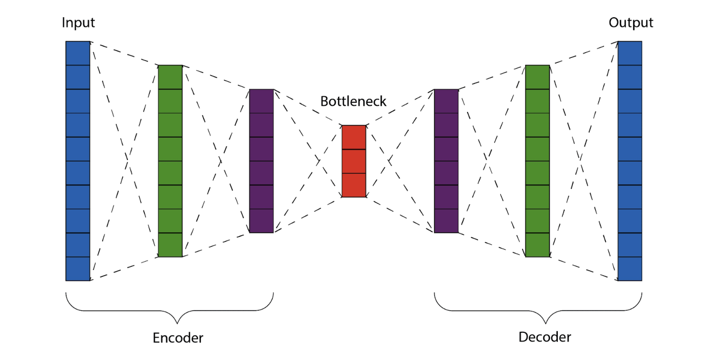

# Autoencoders

Autoencoders (AE) are type of artificial neural network that aims to copy their inputs to their outputs . They work by compressing the input into a **latent-space representation** also known as **bottleneck**, and then reconstructing the output from this representation. Autoencoder is an unsupervised machine learning algorithm. We can define autoencoder as feature extraction algorithm.

The input data may be in the form of speech, text, image, or video. An Autoencoder finds a representation or code in order to perform useful transformations on the input data.

---

## Idea behind Autoencoders

Data compression is a big topic that’s used in computer vision, computer networks, computer architecture, and many other fields. The point of data compression is to convert our input into a smaller(Latent Space) representation that we recreate, to a degree of quality. This smaller representation is what would be passed around, and, when anyone needed the original, they would reconstruct it from the smaller representation

An autoencoder takes an image as input, stores it in a lower dimension, and tries to reproduce the same image as output, hence the term **auto** (which stands for being able to reproduce the input). However, if we just reproduce the input in the output, we would not need a network, but a simple multiplication of the input by 1 would do. The differentiating aspect of an autoencoder is that it encodes the information present in an image in a lower dimension and then reproduces the image, hence the term **encoder** (which stands for representing the information of an image in a lower dimension). This way, images that are similar will have similar encoding. Further, the decoder works towards reconstructing the original image from the encoded vector.

---

## Components of Autoencoder

An autoencoder has three main components, each playing a crucial role in its ability to learn and compress data:

**Encoder:**
This is the "bottleneck" of the autoencoder and is responsible for transforming the input data into a lower-dimensional latent space representation.
It usually consists of several neural network layers (fully connected, convolutional, etc.) that progressively condense the information while capturing the essential features of the input.
The complexity of the encoder depends on the specific application and the type of data being processed.

**Latent Space:**
This is the compressed representation of the input data extracted by the encoder.
It serves as a bridge between the input and output, capturing the core information in a more compact form.
The dimensionality of the latent space is crucial, as it defines the level of compression and the type of features the autoencoder learns.

**Decoder:**
This component "decodes" the latent space representation back into an output that resembles the original input data.
It typically mirrors the architecture of the encoder but in reverse, gradually expanding the dimensionality of the representation until it reaches the original input size.
The decoder's goal is to minimize the difference between the original input and the reconstructed output, allowing the autoencoder to learn a faithful representation of the data.

**Additional components:**

- **Loss function:** This function quantifies the discrepancy between the original input and the reconstructed output. Common choices include mean squared error and cross-entropy.

- **Optimizer:** This algorithm guides the network parameters towards minimizing the loss function and improving the autoencoder's performance. Popular optimizers include Adam and SGD.

---

## Properties of Autoencoder

- Autoencoders are data-specific, which means that they will only be able to compress data similar to what they have been trained on. Example, an autoencoder trained on pictures of faces would do a rather poor job of compressing pictures of trees, because the features it would learn would be face-specific.

- Autoencoders are lossy, which means that the decompressed outputs will be degraded compared to the original inputs.

- Autoencoders are learned automatically from data examples, which is a useful property: it means that it is easy to train specialized instances of the algorithm that will perform well on a specific type of input. It doesn’t require any new engineering, just appropriate training data.

---

## Why use Autoencoders?

1. **Anomaly detection:**

   - Fraud detection: By analyzing financial transactions through an autoencoder, anomalies like fraudulent activities can be flagged based on deviations from the learned normal patterns.

   - Network intrusion detection: Similar to fraud detection, autoencoders can learn the normal traffic patterns in a network and identify intrusions as anomalous data points.

   - Medical diagnosis: Medical images like X-rays or MRI scans can be analyzed by autoencoders to detect abnormalities like tumors or lesions based on their deviation from the healthy learned representation.

2. **Text summarization and topic modeling:**

   - News articles or document summarization: An autoencoder trained on a large corpus of text can learn to capture the essential meaning of a document and generate a concise summary.

   - Topic modeling: Identifying hidden thematic structures within large collections of text documents becomes easier with autoencoders. The latent space representation can reveal clusters of documents with similar topics.

3. **Generative tasks:**

   - Image inpainting: Missing or corrupted parts of images can be reconstructed by an autoencoder trained on similar images, effectively "filling in the blanks."
     Artistic style transfer: The artistic style of one image can be applied to another image using autoencoders to transfer the characteristic features and brushstrokes.

   - Music generation: By learning the underlying patterns of music data, autoencoders can generate new pieces of music in similar styles.

4. **Data augmentation and pre-training:**

   - Synthetic data generation: For tasks where limited data is available, autoencoders can be used to generate synthetic data by learning the underlying distribution of the existing data.

   - Pre-training model features: The latent space representation learned by an autoencoder can be used as pre-trained features for other deep learning models, improving their performance on various tasks.

5. **Explainable AI**:

   - Visualizing data insights: The latent space of an autoencoder can be visualized to understand the underlying structure and relationships within the data, providing insights into the model's decision-making process.

   - Identifying key features: By analyzing the sensitivity of the reconstructed output to changes in the latent space, we can identify the most important features the autoencoder has learned from the data.

These are just a few examples, and the potential applications of autoencoders continue to expand as researchers explore their capabilities further.
