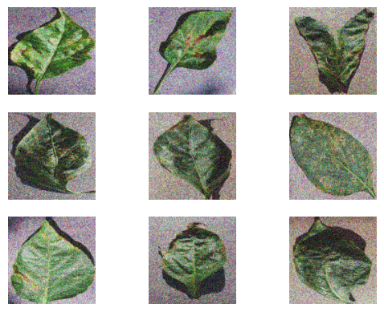

# Noise removal from plant leaf images

---

## Abstract

This autoencoder-based study proposes a novel methodology for noise removal in plant leaf images, enhancing subsequent analysis for disease detection, species identification, stress response assessment and efficient storage of information. The compressed latent space representation learned by the autoencoder effectively filters noise while preserving vital leaf features, leading to improved accuracy and deeper insights into plant health and environmental interactions.

---

## Data preparation

**ignore warnings:**

```python
import warnings
warnings.filterwarnings("ignore")
```

Suppresses all warning messages during the execution of the subsequent code by setting the warning filter to "ignore."

**Loading the data**

```python
from torchvision.datasets import ImageFolder
from torchvision.transforms import Compose, Resize, ToTensor

transf = Compose([Resize((128, 128)), ToTensor()])
noise_train = ImageFolder("./PlantVillage/Noisy_Dataset/Train_Data/", transform=transf)
pure_train = ImageFolder("./PlantVillage/Pure_Dataset/Train_Data/", transform=transf)
noise_test = ImageFolder("./PlantVillage/Noisy_Dataset/Test_Data/", transform=transf)
pure_test = ImageFolder("./PlantVillage/Pure_Dataset/Test_Data/", transform=transf)
```

These lines of code set up four datasets with specified transformations for training and testing, each consisting of pairs of noisy and pure plant images. These datasets is used for training and evaluating our Autoencoder

The transformations that are applied to the dataset are:

- convert the image to `(128, 128)`
- convert the values to tensor

## Visualize Images

### Pure Images

```python
import matplotlib.pyplot as plt

for i in range(9):
    plt.subplot(3, 3, i + 1)
    plt.axis("off")
    plt.imshow(images_pure[i], cmap="gray")
```

Visualize 9 images from the pure dataset in 3x3 grid


### Noisy Images

```python
for i in range(9):
    plt.subplot(3, 3, i + 1)
    plt.axis("off")
    plt.imshow(images_test[i], cmap="gray")
```

Visualize 9 images from the noisy dataset in 3x3 grid



---

## Model Building

```python
from torch import nn

class AutoEncoder(nn.Module):
    def __init__(self):
        super(AutoEncoder, self).__init__()
        self.encoder = nn.Sequential(
            nn.Linear(49152, 5000),
            nn.ReLU(),
            nn.Linear(5000, 500),
            nn.ReLU(),
            nn.Linear(500, 50),
            nn.ReLU(),
            nn.Linear(50, 5),
        )
        self.decoder = nn.Sequential(
            nn.Linear(5, 50),
            nn.ReLU(),
            nn.Linear(50, 500),
            nn.ReLU(),
            nn.Linear(500, 5000),
            nn.ReLU(),
            nn.Linear(5000, 49152),
        )

    def forward(self, x):
        x = x.view(x.size(0), -1)
        y = self.encoder(x)
        z = self.decoder(y)
        z = z.view(z.size(0), 3, 128, 128)
        return z
```

### Encoder Decoder Architecture

The `__init__` method initializes the **Autoencoder's architecture**. The **encoder** is a sequential stack of fully connected (linear) layers with `ReLU` activation functions, reducing the input size from `49152` to `5`.

The **decoder** is another sequential stack of fully connected layers with ReLU activations, reconstructing the input size back to `49152`. The architecture mirrors the encoder but in reverse order.

The forward method defines the forward pass of the autoencoder. It takes an input tensor `x`, which is reshaped to flatten its spatial dimensions.
The flattened input is passed through the **encoder** (self.encoder), producing a latent representation `y`.
The latent representation is then passed through the **decoder** (self.decoder), reconstructing the output `z`.
The final output is reshaped to have the original spatial dimensions `(3 channels, 128x128 pixels)`.

The reconstructed output z represents the autoencoder's attempt to reconstruct the input, and this is what the model aims to optimize during training.

## Testing and Evaluation of model

Before we start to training of our model, we have define an optimizer and the loss function for our model to use

### Check for GPU Availability

```python
device = torch.device("cuda" if torch.cuda.is_available() else "cpu")
print("Using PyTorch version:", torch.__version__, "CUDA:", torch.cuda.is_available())
```

### Loss function and Optimizer Initialzation

```python
model = AutoEncoder().to(device)
loss_func = nn.MSELoss()
optimizer = torch.optim.Adam(model.parameters(), lr=0.002)
```

### Model training loop

```python
from tqdm import tqdm

make_dir()
EPOCH = 5
for epoch in range(EPOCH):
    with tqdm(
        total=len(train_loader), desc=f"Epoch {epoch + 1}", unit="batch"
    ) as epoch_progress_bar:
        for x, y in zip(train_loader, pure_loader):
            t_x, _ = x
            t_x = t_x.to(device)
            t_y, label = y
            t_y = t_y.to(device)
            optimizer.zero_grad()
            decoded1 = model(t_x)
            loss = loss_func(decoded1, t_y)
            train_loss = loss.item()
            loss.backward()
            optimizer.step()
            epoch_progress_bar.set_postfix(train_loss=train_loss)
            epoch_progress_bar.update(1)
        epoch_progress_bar.close()
```

### Model Evaluation Loop

```python
model.eval()
total_loss = 0.0
for batch_idx, (x, y) in enumerate(zip(train_loader, pure_loader)):
    t_x, _ = x
    eval_x = t_x.to(device)
    t_y, _ = y
    eval_y = t_y.to(device)
    decoded2 = model(eval_x)
    loss = loss_func(decoded2, eval_y)
    print(loss)
    total_loss += loss.item()
    for i in range(len(decoded2)):
        save_pic(
            decoded2[i].cpu().data, name=f"./PlantVillage/Denoised_Images/ae_{i}.jpg"
        )
```

---

## Visualize the Denoised Images

Plot the original noisy images

```python
for i in range(64):
    plt.subplot(8, 8, i + 1)
    plt.axis("off")
    plt.imshow(images_arr[i], cmap="gray")
```


Plot the denoised images which are saved in the directory

```python
data = glob("./PlantVillage/Denoised_Images/*.jpg")
images_denoised = [imread(img) for img in data]
for i in range(16):
    plt.subplot(4, 4, i + 1)
    plt.axis("off")
    plt.imshow(images_denoised[i], cmap="gray")
```


---

## Evaluation of our model

```python
model.eval()
for x, y in zip(test_loader, ground_loader):
    t_x, _ = x
    eval_x = t_x.to(device)
    t_y, _ = y
    eval_y = t_y.to(device)
    decoded2 = model(eval_x)
    loss = loss_func(decoded2, eval_y)
    print(loss)
```

Now we are evaluating our `Autoencoder model`, in evaluation mode on a test dataset using a test_loader. It computes the loss between the model's predictions and the ground truth data provided by a ground_loader. The losses are printed for each batch in the test set, helping to assess the model's performance on the test data. The model has been previously set to evaluation mode (model.eval()) to ensure consistent behavior during evaluation.

### Visualize images

```python
for i in range(64):
    plt.subplot(8, 8, i + 1)
    plt.axis("off")
    plt.imshow(images_ground[i], cmap="gray")
```


